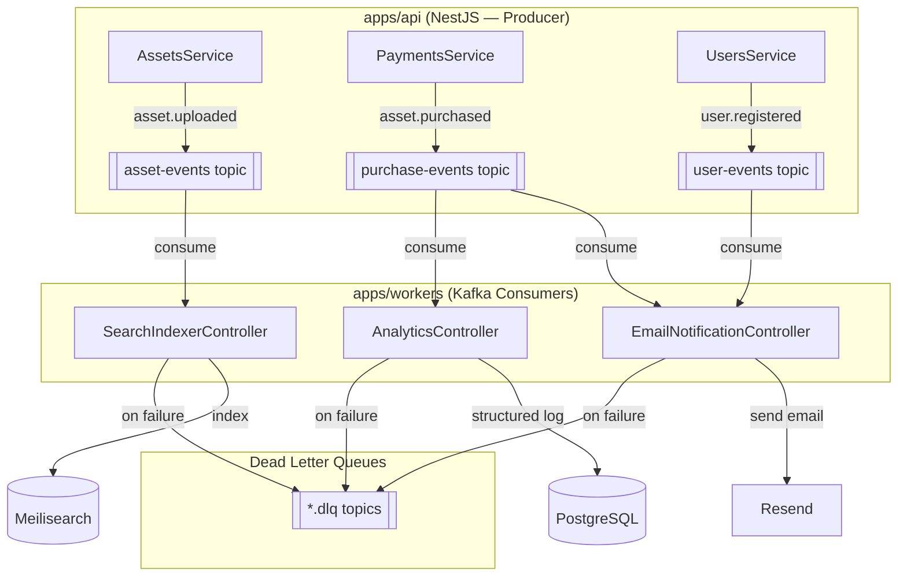

# AssetBox

[](https://github.com/mhtpsd/AssetBox-prod/actions/workflows/ci.yml)


[](https://opensource.org/licenses/MIT)

A **production-grade digital asset marketplace** monorepo — buy and sell digital assets (audio, video, graphics, templates, and more) at scale. Built with a Turborepo monorepo, NestJS, Next.js 15, and an event-driven Kafka pipeline.

---

## 🏗️ Architecture

This is a [Turborepo](https://turbo.build/repo) monorepo with the following structure:

```
AssetBox/
├── apps/
│   ├── api/        # NestJS REST API (port 3001)
│   ├── web/        # Next.js storefront & dashboard (port 3000)
│   ├── docs/       # Next.js documentation site (port 3002)
│   └── workers/    # Kafka consumer microservice (NestJS)
├── packages/
│   ├── config/         # Shared runtime configuration
│   ├── database/       # Prisma schema, migrations, and client
│   ├── email/          # Email service (Resend)
│   ├── templates/      # React Email templates
│   ├── types/          # Shared TypeScript types (incl. Kafka event interfaces)
│   ├── ui/             # Shared React component library (@repo/ui)
│   ├── eslint-config/  # Shared ESLint configuration
│   └── typescript-config/ # Shared TypeScript configuration
└── docker-compose.yml  # Local development infrastructure
```

### Event-Driven Architecture



**Kafka Topics:**

| Topic | Event | Publisher | Consumers |
|---|---|---|---|
| `asset-events` | `asset.uploaded` | `AssetsService` | `SearchIndexerController` |
| `purchase-events` | `asset.purchased` | `PaymentsService` | `EmailNotificationController`, `AnalyticsController` |
| `user-events` | `user.registered` | `UsersService` | `EmailNotificationController` |
| `*.dlq` | Failed messages | `DlqService` | (manual inspection) |

---

## ✨ Features

- 🛒 **Digital asset marketplace** — buy and sell audio, video, graphics, templates, and more
- ⚡ **Event-driven pipeline** — Kafka decouples asset uploads, purchases, and user events from downstream processing
- 🔍 **Full-text search** — Meilisearch powers fast, typo-tolerant asset discovery
- 📧 **Transactional email** — Resend + React Email for magic-link auth and purchase notifications
- 🗃️ **Object storage** — MinIO (S3-compatible) for secure asset file storage
- 💳 **Stripe payments** — checkout, webhooks, and purchase tracking
- 🔐 **Magic link auth** — NextAuth with Prisma adapter, no passwords required
- ☸️ **Kubernetes-ready** — Kustomize overlays for dev/staging/prod, HPA autoscaling
- 🔄 **Background jobs** — BullMQ + Redis for media processing and queued tasks
- 🧱 **Turborepo monorepo** — shared packages, unified lint/build/test pipeline

---

## 🔧 Tech Stack

| Layer | Technology |
|-------|-----------|
| Language | TypeScript 5 |
| Backend | NestJS + Prisma ORM |
| Frontend | Next.js 15 + React 18 + TanStack Query |
| Auth | NextAuth (magic links) |
| Database | PostgreSQL 16 + Flyway-style Prisma migrations |
| Cache / Queue | Redis 7 + BullMQ |
| Messaging | Apache Kafka + Zookeeper |
| Search | Meilisearch |
| Storage | MinIO (S3-compatible) |
| Payments | Stripe |
| Email | Resend + React Email |
| Containers | Docker + Docker Compose |
| Orchestration | Kubernetes + Kustomize |
| CI/CD | GitHub Actions |
| Monorepo | Turborepo |

---

## 🚀 Quick Start

### Prerequisites

- Node.js >= 18
- npm 10
- Docker & Docker Compose

### Run with Docker Compose

```bash
# Clone
git clone https://github.com/mhtpsd/AssetBox-prod.git
cd AssetBox-prod

# Install dependencies
npm install

# Copy environment files
cp .env.example .env
cp apps/api/.env.example apps/api/.env.local
cp apps/workers/.env.example apps/workers/.env.local
cp apps/web/.env.example apps/web/.env.local

# Start infrastructure (PostgreSQL, Redis, Meilisearch, MinIO, Kafka, Zookeeper)
npm run docker:up

# Initialize the database
npm run db:generate
npm run db:migrate

# Start all apps in development mode
npm run dev
```

Services running locally:

| Service | URL |
|---|---|
| Web | http://localhost:3000 |
| API | http://localhost:3001/api |
| Docs | http://localhost:3002 |
| MinIO Console | http://localhost:9001 |
| Meilisearch | http://localhost:7700 |
| Kafka UI | http://localhost:8080 |

---

## ⚙️ Configuration

### Root `.env` (Docker Compose)

| Variable | Description |
|---|---|
| `POSTGRES_USER` | PostgreSQL username |
| `POSTGRES_PASSWORD` | PostgreSQL password |
| `POSTGRES_DB` | PostgreSQL database name |
| `MEILI_MASTER_KEY` | Meilisearch master key |
| `MINIO_ROOT_USER` | MinIO root username |
| `MINIO_ROOT_PASSWORD` | MinIO root password |

### `apps/api/.env.local`

| Variable | Required | Description |
|---|---|---|
| `DATABASE_URL` | Yes | Prisma connection string |
| `NEXTAUTH_SECRET` | Yes | Shared secret with web app |
| `REDIS_HOST` | Yes | Redis hostname |
| `REDIS_PORT` | Yes | Redis port (default: 6379) |
| `REDIS_PASSWORD` | No | Redis password (optional) |
| `STORAGE_ENDPOINT` | Yes | MinIO/S3 endpoint URL |
| `STORAGE_ACCESS_KEY` | Yes | Storage access key |
| `STORAGE_SECRET_KEY` | Yes | Storage secret key |
| `STORAGE_BUCKET_PRIVATE` | Yes | Private bucket name |
| `STORAGE_BUCKET_PUBLIC` | Yes | Public bucket name |
| `STRIPE_SECRET_KEY` | Yes | Stripe secret key |
| `STRIPE_WEBHOOK_SECRET` | Yes | Stripe webhook signing secret |
| `RESEND_API_KEY` | Yes | Resend API key |
| `EMAIL_FROM` | Yes | Sender email address |
| `MEILISEARCH_HOST` | Yes | Meilisearch host URL |
| `MEILISEARCH_API_KEY` | Yes | Meilisearch API key |
| `KAFKA_BROKERS` | No | Comma-separated Kafka brokers (default: `localhost:9092`) |
| `KAFKA_CLIENT_ID` | No | Kafka client ID (default: `assetbox-api`) |
| `KAFKA_GROUP_ID` | No | Kafka consumer group ID (default: `assetbox-consumers`) |

### `apps/workers/.env.local`

| Variable | Required | Description |
|---|---|---|
| `KAFKA_BROKERS` | No | Comma-separated Kafka brokers (default: `localhost:9092`) |
| `KAFKA_CLIENT_ID` | No | Kafka client ID (default: `assetbox-workers`) |
| `KAFKA_GROUP_ID` | No | Kafka consumer group ID (default: `assetbox-consumers`) |
| `MEILISEARCH_HOST` | Yes | Meilisearch host URL |
| `MEILISEARCH_API_KEY` | Yes | Meilisearch API key |
| `RESEND_API_KEY` | Yes | Resend API key |
| `EMAIL_FROM` | Yes | Sender email address |
| `FRONTEND_URL` | No | Frontend URL for email links |

### `apps/web/.env.local`

| Variable | Required | Description |
|---|---|---|
| `NEXTAUTH_SECRET` | Yes | NextAuth secret (same as API) |
| `NEXTAUTH_URL` | Yes | Public URL of the web app |
| `NEXT_PUBLIC_API_URL` | Yes | Public URL of the API |
| `DATABASE_URL` | Yes | Prisma connection string |
| `RESEND_API_KEY` | Yes | Resend API key |
| `EMAIL_FROM` | Yes | Sender email address |

---

## 🧪 Testing

```bash
# Run all tests
npm run test

# Lint all apps and packages
npm run lint

# Type check
npm run type-check

# Build all apps and packages
npm run build
```

---

## 🐳 Docker

```bash
# Build API image
docker build -f apps/api/Dockerfile -t assetbox-api:local .

# Build Web image
docker build -f apps/web/Dockerfile -t assetbox-web:local .

# Build Workers image
docker build -f apps/workers/Dockerfile -t assetbox-workers:local .

# Run production stack
docker compose -f docker-compose.prod.yml up -d
```

Three production Docker images are published to [GitHub Container Registry (GHCR)](https://ghcr.io/mhtpsd):

| Image | Registry |
|---|---|
| `assetbox-api` | `ghcr.io/mhtpsd/assetbox-api` |
| `assetbox-web` | `ghcr.io/mhtpsd/assetbox-web` |
| `assetbox-workers` | `ghcr.io/mhtpsd/assetbox-workers` |

---

## ☸️ Kubernetes

Kubernetes manifests live in `k8s/`, organized with [Kustomize](https://kustomize.io/) overlays.

```
k8s/
├── namespace.yaml
├── base/
│   ├── api/            # NestJS API: Deployment + Service + HPA
│   ├── web/            # Next.js: Deployment + Service
│   ├── workers/        # Kafka workers: Deployment + HPA
│   ├── ingress/        # Nginx Ingress routing
│   ├── postgres/       # PostgreSQL StatefulSet + PVC
│   ├── redis/          # Redis Deployment
│   ├── kafka/          # Zookeeper + Kafka StatefulSets
│   ├── meilisearch/    # Meilisearch Deployment + PVC
│   ├── minio/          # MinIO Deployment + PVC
│   └── configmaps-secrets/
└── overlays/
    ├── dev/            # 1 replica, lower resources
    ├── staging/        # 2 replicas, medium resources
    └── prod/           # 3+ replicas API, higher resources
```

```bash
# Development (1 replica)
kubectl apply -k k8s/overlays/dev

# Staging (2 replicas)
kubectl apply -k k8s/overlays/staging

# Production (3+ replicas)
kubectl apply -k k8s/overlays/prod

# Check pods
kubectl get pods -n assetbox
```

---

## 📊 CI/CD Pipeline

GitHub Actions workflows automate quality checks, image builds, and deployment.

| Workflow | Trigger | Description |
|---|---|---|
| `ci.yml` | Push/PR to `main`/`develop` | Lint → Type check → Build → Test → Docker Build+Push → Deploy |
| `docker-build.yml` | Push tag `v*` | Builds and pushes semver-tagged release images |

Pipeline flow:

```
Push to main
     │
     ├─── lint          (ESLint across all packages)
     ├─── type-check    (tsc --noEmit on API)
     ├─── build         (Turborepo build all)
     └─── test          (Jest across all packages)
               │
               └─── docker-build  (builds 3 images → pushes to GHCR)
                          │
                          └─── deploy  (kubectl set image)
```

To enable Kubernetes deployment, add a `KUBECONFIG_DATA` secret (base64-encoded `~/.kube/config`) to your repository secrets and uncomment the deploy steps in `ci.yml`.

---

## 📁 Available Scripts

| Script | Description |
|---|---|
| `npm run dev` | Start all apps in development mode |
| `npm run build` | Build all apps and packages |
| `npm run lint` | Lint all apps and packages |
| `npm run test` | Run all tests |
| `npm run db:generate` | Regenerate Prisma client |
| `npm run db:migrate` | Run database migrations |
| `npm run db:push` | Push schema to database (dev only) |
| `npm run db:studio` | Open Prisma Studio |
| `npm run docker:up` | Start infrastructure containers |
| `npm run docker:down` | Stop infrastructure containers |
| `npm run docker:reset` | Reset and restart infrastructure |

---

## 📄 License

MIT © [Mohit Prasad](https://github.com/mhtpsd)
